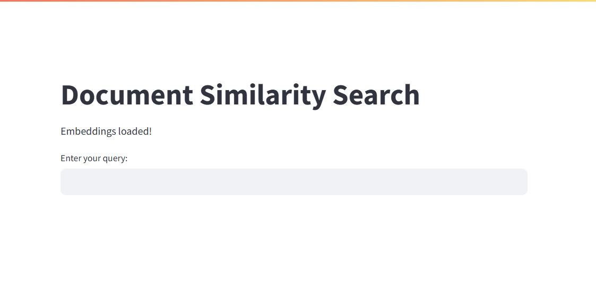
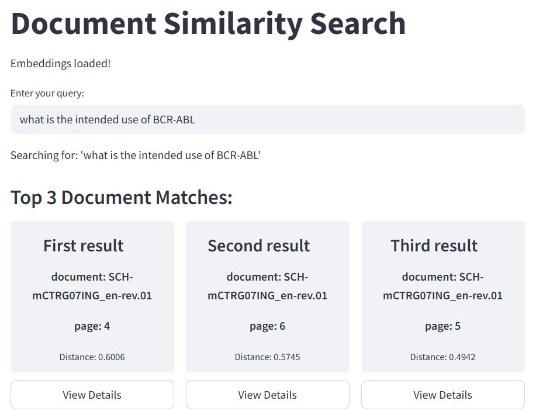
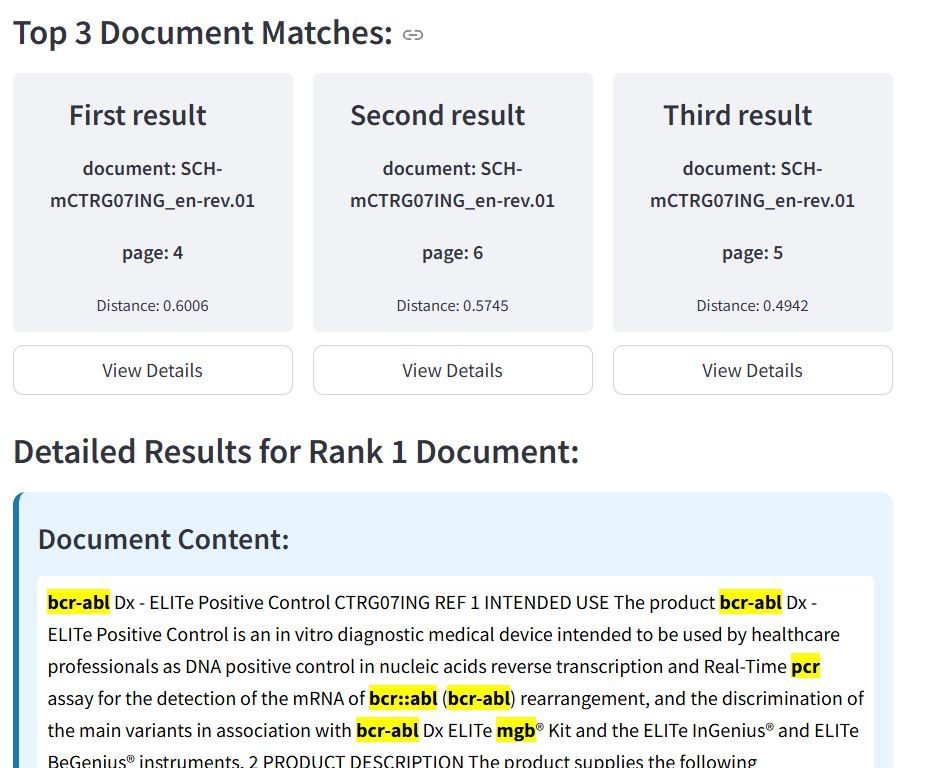
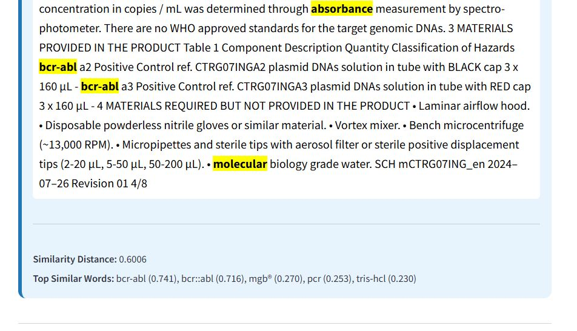
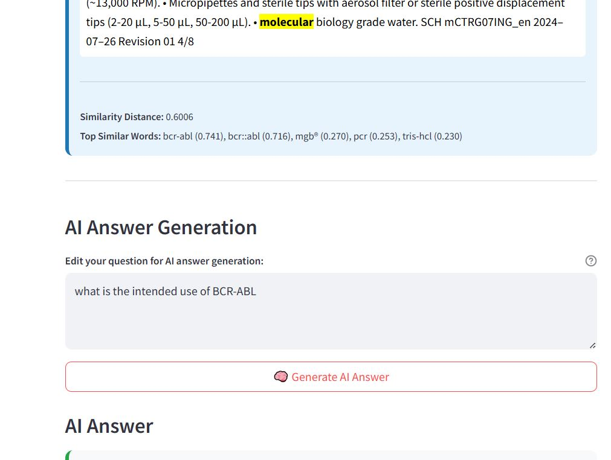
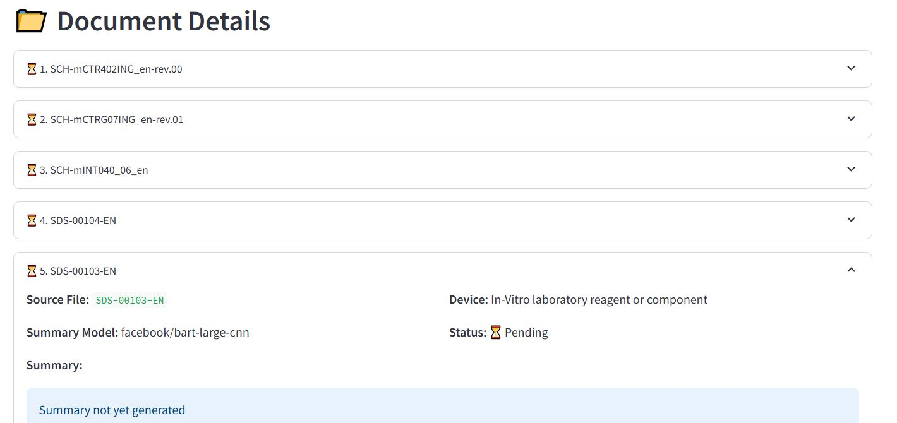

# 🏥 medical-rag (WIP)

A lightweight **Retrieval-Augmented Generation (RAG)** app for querying medical documents using local PDFs.

files:
- app.py - streamlit app
- helper_functions.py - helper functions
- requirments.txt
- how_to.txt
- generate_db.ipynb - parse pdf's, create db, llm summary and metadata, evaluation

---

## ⚙️ Tech Stack

- **Frontend**: Streamlit  
- **PDF Embeddings**: `sentence-transformers/all-MiniLM-L6-v2`  
- **LLM for Answers**: `google/flan-t5-small`  
- **Hosting**: AWS EC2 (Free Tier)

---

## 🔍 Features

### 📥 1. Insert a Query

---

### 📑 2. Retrieve Top 3 Most Relevant Documents / Chunks

---

### 📂 3. View Content of Each Document

---

### 🧠 4. See Similarity Scores & Key Matching Terms

---

### ✍️ 5. Generate AI Answer (With Editable Query)

---

### 🧾 6. Summarization, tags and more data to metadata

---

## 📌 Notes

- This is a **Work in Progress**.
- Designed for fast prototyping on minimal infrastructure.
- this readme file created using chatGPT

---

## 🛠️ To Do

- [ ] Improve UI/UX
- [ ] Add document upload from frontend
- [ ] improve document splitting and embedding
- [ ] improve similarity search 
- [X] ~~add database summary,tags and more data to metadata~~
- [ ] add short summary to metadata
- [ ] improve answer generation
- [ ] Switch to more powerful LLM (optional)

